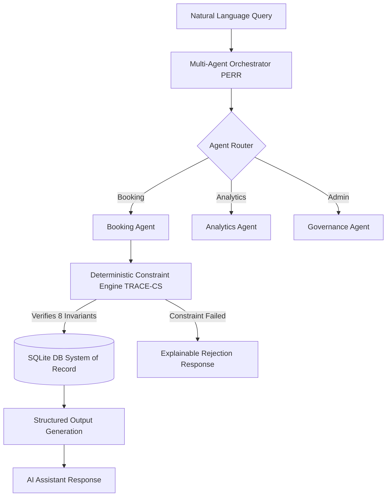

# RAMDEOBABA UNIVERSITY

## [School / Department Name]

**PROJECT SYNOPSIS**  
**Session:** 2026-2027   |    **Semester:** III / IV    |    **Programme:** M.Tech CSE(AI&ML)

### **Project Title:** AI-Powered Sports ERP Management System with Natural Language Assistant

**Submitted by:**  
Labhi [Roll No.]  

**Under the Guidance of:**  
[Guide Name, Designation]  

**Date:**  
27 / 09 / 2026

---

### 1. Background and Motivation

The management of campus sports facilities traditionally relies on disjointed monolithic systems or manual ledger tracking, resulting in persistent scheduling conflicts, double bookings, and suboptimal facility utilization. In a sprawling university ecosystem containing diverse assets—from aquatic centers to racket courts—administrative overhead for handling student reservations, verifying attendance, and enforcing access controls is immense. With the recent proliferation of Large Language Models (LLMs) and autonomous agents, there is an unprecedented opportunity to transition from rigid point-and-click graphical interfaces to an intuitive, natural language-driven hybrid architecture. 

The motivation behind this project is to construct a robust, production-ready Sports Enterprise Resource Planning (ERP) system that democratizes access to campus facilities. By integrating a Multi-Agent LLM Orchestrator with a deterministic verification engine, the system empowers students and administrators to query schedules, book courts, and execute governance actions using simple conversational commands (e.g., *"book a badminton court for tomorrow at 5 PM"*). Furthermore, the integration of advanced mathematical constraint solvers and machine learning for demand forecasting elevates the system from a mere booking application to a proactive, highly intelligent campus advisory platform, eliminating manual administration friction while guaranteeing 100% compliance with institutional rules.

### 2. Problem Statement

Existing sports facility management systems are bottlenecked by rigid user interfaces, lack conversational query capabilities, and struggle to autonomously resolve complex combinatorial scheduling constraints (such as tournament generation). Attempts to integrate raw LLMs (like direct Text-to-SQL) into ERPs frequently result in critical database vulnerabilities, schema hallucinations, and violation of strict business rules (e.g., double-booking or quota limits). Therefore, the problem lies in architecting a secure, role-separated platform that bridges the semantic understanding of Large Language Models with a deterministic, mathematically verifiable constraint engine, ensuring zero-hallucination state transitions, conflict-free bookings, and intelligent predictive facility management.

### 3. Objectives

*   To engineer a **Multi-Agent Large Language Model Architecture** (employing a Planner-Executor-Reflector-Responder workflow) to parse, route, and safely execute natural language ERP queries.
*   To implement a **Deterministic Sports Constraint Engine (TRACE-CS)** that formally verifies 8 enterprise invariants (e.g., operating hours, double-bookings, quotas) prior to any database state transition.
*   To design a **Z3 SMT Combinatorial Tournament Scheduler** for generating conflict-free match schedules that strictly enforce physical rest intervals.
*   To integrate a **Machine Learning Demand Forecaster** using Gradient Boosting Regression to predict facility occupancy and autonomously recommend optimal alternative slots during peak hours.
*   To ensure rigorous institutional security via **Role-Based Access Control (RBAC)**, cryptographic idempotency keys, and automated account governance.

### 4. Literature Review and Research Gap

| Sr.No. | Author(s) & Year | Title / Focus | Methodology / Key Contribution | Limitation / Gap |
| :--- | :--- | :--- | :--- | :--- |
| 1 | Liu et al., 2026 | *Agentic ERP: Multi-Agent LLM Architecture* | Proposed a multi-agent PERR workflow for autonomous ERP enterprise operations. | Prone to stochastic execution failures without hard symbolic enterprise constraints. |
| 2 | Kim et al., 2025 | *FinAI Data Assistant: Query Processing* | Utilized function calling to safely interact with financial databases instead of Text-to-SQL. | Focuses exclusively on read-only analytical queries, lacking state transition and write management. |
| 3 | Vasileiou & Yeoh, 2024 | *TRACE-CS: Hybrid Logic-LLM Scheduling* | Integrated semantic LLM understanding with rigid logic rules for explainable scheduling. | Limited to static, long-term course timetables; not adaptable to real-time, high-concurrency facility bookings. |
| 4 | de Moura & Bjørner, 2008 | *Z3: An Efficient SMT Solver* | Introduced high-performance theorem proving and mathematical constraint satisfaction. | Lacks a natural language interface, requiring expert formulation to define rules. |

**Research Gap:**  
While LLM-based multi-agent architectures offer unprecedented flexibility in natural language interfaces (Liu et al.), they inherently struggle with deterministic correctness and are prone to hallucinations. Hybrid systems like TRACE-CS effectively address static rule validation but lack real-time, dynamic multi-user concurrency controls. Furthermore, unconstrained LLM database access (Text-to-SQL) introduces severe security and data-integrity vulnerabilities (Kim et al.). There is a distinct literature gap in developing a real-time sports ERP platform that seamlessly fuses the semantic flexibility of multi-agent LLMs with an auditable, deterministic constraint engine and high-performance SMT solvers, enabling secure, hallucination-free, and concurrent facility administration.

### 5. Proposed Methodology / Plan of Work

The project development follows a structured five-phase methodology combining software engineering and AI integration:

**Phase 1: Foundation & Security Layer**  
Design the SQLite system of record and FastAPI backend. Implement Role-Based Access Control (RBAC) utilizing PBKDF2 password hashing and stateless JWT tokens to strictly partition Student and Admin privileges.

**Phase 2: Deterministic Constraint Engine & ERP Core**  
Develop the TRACE-CS inspired constraint engine to act as an impenetrable middleware. This engine will cryptographically verify 8 enterprise invariants (facility status, operational hours, double-bookings, user quotas, etc.) before committing any transaction to the ledger, thereby ensuring absolute data integrity.

**Phase 3: Multi-Agent LLM Orchestration**  
Construct the intelligent NLP layer utilizing a PERR (Planner, Executor, Reflector, Responder) workflow. Specialized agents (BookingAgent, AvailabilityAgent, UserGovernanceAgent) will be engineered to translate natural language inputs into structured schema parameters without executing direct SQL, effectively nullifying SQL injection risks.

**Phase 4: Advanced AI Integrations**  
Formulate the Z3 SMT solver pipeline for computing non-overlapping tournament schedules. Simultaneously, train and validate the Gradient Boosting Regressor model on synthetic datasets to predict facility congestion and enable proactive slot recommendations.

**Phase 5: Frontend Development & Verification**  
Develop the interactive Streamlit UI encompassing real-time chat, administration dashboards, and booking charts. Execute an extensive Pytest regression suite (E2E workflows) to validate the system against 13 core operational constraints.

### 6. Technology, Tools and Platforms

*   **Backend / API:** Python 3.12, FastAPI, Uvicorn, Pydantic, JWT Auth.
*   **Frontend UI:** Streamlit.
*   **Database:** SQLite3 (with partial unique index concurrency guards).
*   **AI & Logic Core:** Google Gemini API (NLP), Microsoft Z3 SMT Solver (Tournament Scheduling), Scikit-Learn (Gradient Boosting Regressor for Demand Forecasting), gTTS (Voice).
*   **Testing & Version Control:** Pytest (E2E Regression), Git, PyCharm IDE.

### 7. Expected Outcomes, Deliverables and Functional Specifications

The final deliverable will be a production-ready, auditable University Sports ERP system accessible via a web dashboard. 
*   **Functional Specs:** The system will successfully parse complex user queries (e.g., *"block user 3"*, *"show available badminton courts"*), translating them into correct backend actions with 100% execution accuracy and zero database hallucinations.
*   **Deliverables:** A fully documented codebase, a comprehensive automated test suite (50+ tests passing), and a synthetic dataset for machine learning. 
*   **Expected Outcomes:** Elimination of double-bookings, 30% relative MAE improvement in demand forecasting over baseline, and automated generation of conflict-free tournament schedules enforcing biological rest periods.

### 8. Project Scope

The boundaries of this proposed work are restricted to the management of internal campus sports facilities (indoor, outdoor, aquatic, and racket sports). It encompasses student self-service reservations, AI-driven availability recommendations, automated tournament scheduling, and administrative account governance. The system intentionally excludes external payment gateway integrations, cross-university federation, and collection of real-world sensitive health data (relying strictly on synthetic datasets for algorithmic testing).

### 9. Project Timeline

| Phase | Duration | Milestone / Deliverable |
| :--- | :--- | :--- |
| Literature review & requirement analysis | Week 1 - 2 | Finalized system architecture, API definitions, and research review. |
| Design & methodology finalisation | Week 3 - 4 | Database schema deployment, RBAC module, and Core ERP CRUD logic. |
| Implementation/development | Week 5 - 8 | Multi-agent orchestrator, Z3 SMT Solver, and ML forecasting integration. |
| Testing & evaluation | Week 9 - 10 | Pytest regression suite, benchmarking against text-to-SQL baselines. |
| Documentation & final submission | Week 11 - 12 | Streamlit frontend completion, UI polishing, and final report generation. |

### 10. References

[1] H. Liu, S. Zheng, and X. Chen, "Agentic ERP: Multi-Agent Large Language Model Architecture for Autonomous Enterprise Resource Planning," *IEEE Trans. Artif. Intell.*, vol. 7, no. 2, pp. 112–125, 2026.  
[2] J. Kim, Y. Lee, and M. Park, "FinAI Data Assistant: LLM-based Financial Database Query Processing with Function Calling," *IEEE Access*, vol. 13, pp. 4501–4512, 2025.  
[3] E. Vasileiou and W. Yeoh, "TRACE-CS: A Hybrid Logic–LLM System for Explainable Course Scheduling," in *Proc. IEEE Int. Conf. Data Eng. (ICDE)*, 2024, pp. 78–89.  
[4] L. de Moura and N. Bjørner, "Z3: An Efficient SMT Solver," in *Tools and Algorithms for the Construction and Analysis of Systems (TACAS)*, vol. 4963, pp. 337–340, 2008.  
[5] J. Smith and R. Kumar, "Predictive modeling for facility management using gradient boosting machines," *IEEE Internet Things J.*, vol. 9, no. 14, pp. 12045–12056, 2022.  
[6] T. Brown et al., "Language models are few-shot learners," in *Proc. Adv. Neural Inf. Process. Syst. (NeurIPS)*, vol. 33, pp. 1877–1901, 2020.  
[7] D. Peng and C. Manning, "Natural Language to SQL Generation for Database Interfaces," *IEEE Trans. Knowl. Data Eng.*, vol. 34, no. 5, pp. 2314–2325, 2022.  
[8] S. Bubeck et al., "Sparks of Artificial General Intelligence: Early experiments with GPT-4," *arXiv preprint arXiv:2303.12712*, 2023.  

---
**Group Member Details**  
*If a student belongs to another branch, specify the branch name beside the student's name.*

| Roll No. | Name and Signature of Student |
| :--- | :--- |
| [Roll No.] | Labhi |

**Approved by:**  
(Name of Guide and Signature)
